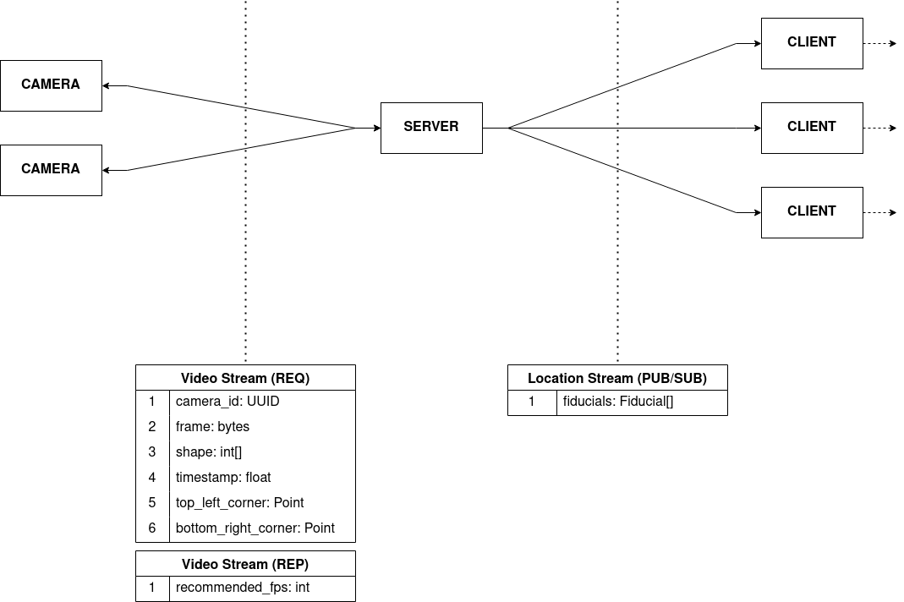

# Fiducial Tracker

  
  
  
  

An array of cameras sends video streams to the server module. There, the server, using `zxingcpp`, a general purpose barcode code scanning library, analyzes for QR code fiducials, and published their tracked locations to listening clients.

Communication between cameras and server is accomplished using REQ/REP sockets. This is so that the server can regulate the input camera feed to reduce staleness of communicated frames from video streams.

## Conda Environment

To run the code, setup the necessary `conda` environment by running `conda env create -f environment.yml`.

## Firebase Connection

To publish the tracked fiducial locations to your Firebase instance, set the `FIREBASE_DATABASE_URL` environment variable. If you are setting the environment with a `.env` file, create the `.env` in the same folder as this `README`. Then, download the `firebase` RTDB certificate JSON and pass it as the `--firebase-certificate` parameter for the `client` submodule.
